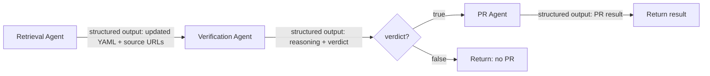

# Three-Agent Pipeline Refactor

## Architecture

The current single agent in `[agents/agent.py](agents/agent.py)` will be split into a sequential 3-stage pipeline, each stage being a separate `query()` call with its own system prompt and structured output schema.




## Structured Output Schemas

### Agent 1 - Information Retrieval

Returns whether an update is needed, the agent's reasoning, a summary of changes, the proposed updated YAML content, and the source URLs used to find the information. Schema:

```python
RETRIEVAL_RESULT_SCHEMA = {
    "type": "object",
    "properties": {
        "requires_update": {"type": "boolean", "description": "Whether the conference data needs updating"},
        "reasoning": {"type": "string", "description": "Explanation of why the data does or does not need updating"},
        "changes_summary": {"type": "string", "description": "Summary of the specific changes made to the YAML"},
        "updated_yaml": {"type": "string", "description": "The full updated YAML content"},
        "source_urls": {
            "type": "array",
            "items": {"type": "string"},
            "description": "URLs used as sources for the information",
        },
    },
    "required": ["requires_update", "reasoning", "changes_summary", "updated_yaml", "source_urls"],
}
```

### Agent 2 - Verification

Checks the source URLs from agent 1 and confirms the information is accurate. Schema:

```python
VERIFICATION_RESULT_SCHEMA = {
    "type": "object",
    "properties": {
        "reasoning": {"type": "string"},
        "verdict": {"type": "boolean"},
    },
    "required": ["reasoning", "verdict"],
}
```

### Agent 3 - PR Creation

Existing `PR_RESULT_SCHEMA` is reused (already defined in current code).

## File Changes

### 1. Prompt files (new + modified)

- `**[agents/prompts/system_prompt.md](agents/prompts/system_prompt.md)**` -- Rename to `retrieval_system_prompt.md`. Remove the "Use of git" section entirely. Adjust the "Task" section to instruct the agent to return information rather than edit files. Remove Bash tool mention (retrieval agent should only search).
- `**[agents/prompts/user_prompt.md](agents/prompts/user_prompt.md)**` -- Rename to `retrieval_user_prompt.md`. Add instruction to return the updated YAML and source URLs as structured output.
- `**agents/prompts/verification_system_prompt.md**` (new) -- Instruct the agent that it is a verification agent. It receives proposed YAML changes with source URLs. It must visit/search the source URLs to confirm each claimed fact (deadlines, venue, dates, etc.) is accurate. It should return reasoning and a boolean verdict.
- `**agents/prompts/verification_user_prompt.md**` (new) -- Template with placeholders for: conference name, current YAML, proposed updated YAML, changes summary, source URLs.
- `**agents/prompts/pr_system_prompt.md**` (new) -- Minimal prompt explaining the agent should write the YAML file, create a branch, commit, push, and open a PR. Contains the git instructions (extracted from current system prompt's "Use of git" section).
- `**agents/prompts/pr_user_prompt.md**` (new) -- Template with placeholders for: conference name, verified YAML content to write, changes summary.

### 2. Main agent module

`**[agents/agent.py](agents/agent.py)**` -- Major refactor:

- Define the 3 schemas (`RETRIEVAL_RESULT_SCHEMA`, `VERIFICATION_RESULT_SCHEMA`, `PR_RESULT_SCHEMA`).
- Extract shared helper: `_run_agent(system_prompt, user_prompt, output_schema, mcp_servers, on_message_callback) -> dict` that wraps a single `query()` call with structured output and message logging. This avoids triplicating the message-loop boilerplate.
- `**run_retrieval_agent(conference_name) -> dict**` -- Loads conference YAML, reads retrieval prompts, runs agent with web search tools, returns structured retrieval result.
- `**run_verification_agent(conference_name, retrieval_result) -> dict**` -- Reads verification prompts, injects retrieval output into user prompt, runs agent with web search tools, returns structured verification result.
- `**run_pr_agent(conference_name, verified_yaml, changes_summary) -> dict**` -- Reads PR prompts, runs agent with Bash/git access, returns PR result.
- `**find_conference_deadlines(conference_name) -> dict**` -- Orchestrator that calls the 3 agents in sequence. If retrieval returns `requires_update=False`, short-circuits. If verification returns `verdict=False`, short-circuits. Otherwise proceeds to PR agent. Returns the final result dict.
- Keep the `__main__` CLI block unchanged.

### 3. Modal wrapper

`**[agents/modal_agent.py](agents/modal_agent.py)**` -- No changes required to the interface since `find_conference_deadlines` retains the same signature and return shape. The internal pipeline is transparent to the caller.

## Key Design Decisions

- The retrieval agent does NOT get Bash tool access (controlled via prompt instructions, since the SDK doesn't support tool restriction). Its prompt explicitly says to only search and return information.
- The verification agent gets web search tools so it can independently check source URLs.
- The PR agent gets Bash access and the verified YAML content to write. It does not need web search.
- Each agent uses the same `_run_agent` helper to avoid code duplication for the `query()` message loop, stderr handling, MCP config, etc.
- The orchestrator prints clear stage headers (`=== Stage 1: Information Retrieval ===`, etc.) for log readability.