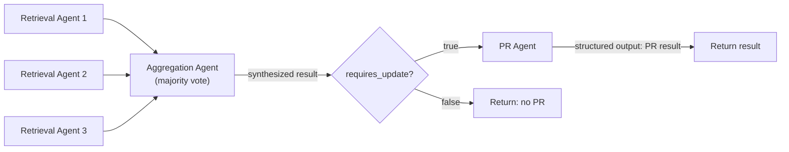

# Three-Agent Pipeline Refactor

## Architecture

The current single agent in `[agents/agent.py](agents/agent.py)` will be split into a sequential 3-stage pipeline, each stage being a separate `query()` call with its own system prompt and structured output schema.



The retrieval stage runs N agents sequentially (default N=3) in a simple `for` loop. An aggregation agent then receives all N results and performs a majority vote to select the most consistent and well-sourced answer.


## Structured Output Schemas

### Agent 1 - Information Retrieval

Returns whether an update is needed, the agent's reasoning, a summary of changes, the proposed updated YAML content, and the source URLs used to find the information. Schema:

```python
RETRIEVAL_RESULT_SCHEMA = {
    "type": "object",
    "properties": {
        "requires_update": {"type": "boolean", "description": "Whether the conference data needs an update"},
        "reasoning": {"type": "string", "description": "Explanation of why the data does or does not need an update"},
        "updated_yaml": {"type": "string", "description": "The full updated YAML content"},
        "source_urls": {
            "type": "array",
            "items": {"type": "string"},
            "description": "URLs used as sources for the information",
        },
    },
    "required": ["requires_update", "reasoning", "updated_yaml", "source_urls"],
}
```

### Agent 1b - Aggregation (Majority Vote)

Receives all N retrieval results, compares them, and synthesizes a single result. Rather than selecting one result verbatim, it produces its own updated YAML based on the consensus across the individual results. Schema:

```python
AGGREGATION_RESULT_SCHEMA = {
    "type": "object",
    "properties": {
        "reasoning": {"type": "string", "description": "Explanation of how the majority vote was performed, how the results were compared, where the colleagues agreed/disagreed, and how the synthesis was derived"},
        "requires_update": {"type": "boolean", "description": "Whether the conference data needs updating (based on majority agreement)"},
        "updated_yaml": {"type": "string", "description": "The synthesized updated YAML content"},
        "source_urls": {
            "type": "array",
            "items": {"type": "string"},
            "description": "Combined source URLs from the retrieval results that support the synthesized output",
        },
    },
    "required": ["reasoning", "requires_update", "confidence", "updated_yaml", "source_urls"],
}
```

### Agent 2 - PR Creation

Existing `PR_RESULT_SCHEMA` is reused (already defined in current code).

## File Changes

### 1. Prompt files (new + modified)

- `**[agents/prompts/system_prompt.md](agents/prompts/system_prompt.md)**` -- Rename to `retrieval_system_prompt.md`. Remove the "Use of git" section entirely. Adjust the "Task" section to instruct the agent to return information rather than edit files. Remove Bash tool mention (retrieval agent should only search). This prompt is shared by both the individual retrieval agents and the aggregation agent.
- `**[agents/prompts/user_prompt.md](agents/prompts/user_prompt.md)**` -- Rename to `retrieval_user_prompt.md`. Add instruction to return the updated YAML and source URLs as structured output.
- `**agents/prompts/aggregation_user_prompt.md**` (new) -- Uses the same system prompt as the retrieval agent. The user prompt includes the original retrieval task context plus the N results from colleague agents, and instructs the agent to synthesize a majority-vote result from them.
- `**agents/prompts/pr_system_prompt.md**` (new) -- Minimal prompt explaining the agent should write the YAML file, create a branch, commit, push, and open a PR. Contains the git instructions (extracted from current system prompt's "Use of git" section).
- `**agents/prompts/pr_user_prompt.md**` (new) -- Template with placeholders for: conference name, verified YAML content to write, changes summary.

### 2. Main agent module

`**[agents/agent.py](agents/agent.py)**` -- Major refactor:

- Define the 3 schemas (`RETRIEVAL_RESULT_SCHEMA`, `AGGREGATION_RESULT_SCHEMA`, `PR_RESULT_SCHEMA`).
- Extract shared helper: `_run_agent(system_prompt, user_prompt, output_schema, mcp_servers, on_message_callback) -> dict` that wraps a single `query()` call with structured output and message logging. This avoids triplicating the message-loop boilerplate.
- `**run_retrieval_agent(conference_name) -> dict**` -- Loads conference YAML, reads retrieval prompts, runs agent with web search tools, returns structured retrieval result.
- `**run_retrieval_agents(conference_name, n=3) -> list[dict]**` -- Runs N retrieval agents sequentially in a `for` loop. Returns a list of N retrieval results.
- `**run_aggregation_agent(conference_name, retrieval_results) -> dict**` -- Reads aggregation prompts, injects all N retrieval results into user prompt, runs agent (no web tools needed — purely analytical), returns the majority-vote selected result.
- `**run_pr_agent(conference_name, verified_yaml, changes_summary) -> dict**` -- Reads PR prompts, runs agent with Bash/git access, returns PR result.
- `**find_conference_deadlines(conference_name, num_retrieval_agents=3) -> dict**` -- Orchestrator: (1) runs N retrieval agents sequentially, (2) runs aggregation agent for majority vote, (3) if aggregation returns `requires_update=False`, short-circuits, (4) runs PR agent. Returns the final result dict.
- The `__main__` CLI block accepts an optional `--num-retrieval-agents` argument (default 3) and passes it to `find_conference_deadlines`.

### 3. Modal wrapper

`**[agents/modal_agent.py](agents/modal_agent.py)**` -- Add `num_retrieval_agents` parameter (default 3) and pass it through to `find_conference_deadlines`.

## Tool Access Per Agent

| Tool | Retrieval | Aggregation | PR |
|------|-----------|-------------|-----|
| Bash | Yes | No | Yes |
| Web Search | Yes | No | No |
| Web Fetch | Yes | No | No |
| Grep | Yes | No | Yes |
| Glob | Yes | No | Yes |
| Exa MCP | Yes | No | No |

- The **aggregation agent** needs no tools — it performs a purely analytical majority vote over the N retrieval results passed in its prompt.
- The **PR agent** only needs Bash (for git/GitHub CLI), Grep, and Glob. It receives the aggregated data and doesn't need web access.

## Key Design Decisions

- Each agent uses the same `_run_agent` helper to avoid code duplication for the `query()` message loop, stderr handling, MCP config, etc.
- The orchestrator prints clear stage headers (`=== Stage 1: Information Retrieval ===`, etc.) for log readability.