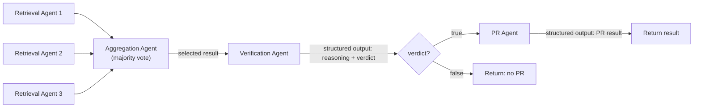

# AI Agents

This folder contains 2 scripts which leverage the [Claude Agents SDK](https://platform.claude.com/docs/en/agent-sdk/overview) to automatically populate the data of the [AI Deadlines web app](https://huggingface.co/spaces/huggingface/ai-deadlines).

## Usage

First create a `keys.env` file at the root of the repository which contains the following environment variables:

```bash
ANTHROPIC_API_KEY=
GITHUB_PAT=
EXA_API_KEY=
```

In case you want to leverage [MiniMax 2.1](https://huggingface.co/MiniMaxAI/MiniMax-M2.1) instead of Claude, get your API key from https://platform.minimax.io/ and add the following:

```bash
ANTHROPIC_BASE_URL=https://api.minimax.io/anthropic
```

Next, the agent can be run like so on a conference of choice:

```bash
uv run --env-file keys.env -m agents.agent --conference_name neurips
```

The agent will automatically fetch relevant information from the web using the [Exa MCP server](https://docs.exa.ai/reference/exa-mcp) to populate the data at `src/data/conferences` and open a pull request.

## Modal deployment

To automatically let the AI agents populate deadlines data, we leverage [Modal](https://modal.com/)'s serverless infrastructure.

### Setup

1. Install Modal: `uv add modal`
2. Authenticate: `uv run modal setup`
3. Create the required secrets:

```bash
uv run modal secret create anthropic ANTHROPIC_API_KEY=<your-api-key>
uv run modal secret create github-token GH_TOKEN=<token-with-repo-and-pr-scope>
uv run modal secret create exa EXA_API_KEY=<your-key>
```

> **Note:** The `GH_TOKEN` needs the `repo` scope (for cloning, pushing, and creating pull requests).

### Running a single conference

```bash
uv run modal run agents/modal_agent.py --conference-name neurips
```

### Running all conferences in parallel

By default (no flags), the script processes **all** conferences in parallel — each in its own Modal container:

```bash
uv run modal run agents/modal_agent.py
```

You can also be explicit:

```bash
uv run modal run agents/modal_agent.py --all-conferences
```

To test with a limited number of conferences, use the `--limit` flag:

```bash
uv run modal run agents/modal_agent.py --limit 3
```

### Deploying for scheduled runs

To deploy the agent so it runs automatically every week (Sunday at midnight UTC):

```bash
uv run modal deploy agents/modal_agent.py
```

The structure looks as follows:

