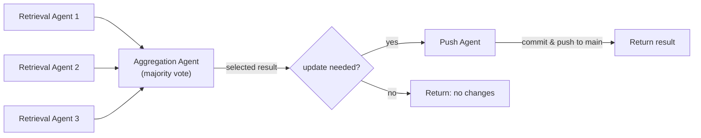

# AI Agents

This folder contains the agent entrypoint and wrappers ([`agent.py`](agent.py), [`modal_agent.py`](modal_agent.py), [`hf_jobs_agent.py`](hf_jobs_agent.py)) that use the [Claude Agents SDK](https://platform.claude.com/docs/en/agent-sdk/overview) to automatically populate the data of the [AI Deadlines web app](https://huggingface.co/spaces/huggingface/ai-deadlines).

## Usage

First create a `keys.env` file at the root of the repository which contains the following environment variables:

```bash
ANTHROPIC_API_KEY=
GITHUB_PAT=
EXA_API_KEY=
```

In case you want to leverage [MiniMax 2.1](https://huggingface.co/MiniMaxAI/MiniMax-M2.1) instead of Claude, get your API key from https://platform.minimax.io/ and add the following:

```bash
ANTHROPIC_BASE_URL=https://api.minimax.io/anthropic
```

Next, the agent can be run like so on a conference of choice:

```bash
uv run --env-file keys.env -m agents.agent --conference_name neurips
```

The agent will automatically fetch relevant information from the web using the [Exa MCP server](https://docs.exa.ai/reference/exa-mcp) to populate the data at `src/data/conferences` and push the update directly to main.

## Modal deployment

To automatically let the AI agents populate deadlines data, we leverage [Modal](https://modal.com/)'s serverless infrastructure. Conferences are processed **sequentially** — each update is committed and pushed to main before the next conference starts, avoiding merge conflicts.

### Setup

1. Install Modal: `uv add modal`
2. Authenticate: `uv run modal setup`
3. Create the required secrets:

```bash
uv run modal secret create anthropic ANTHROPIC_API_KEY=<your-api-key>
uv run modal secret create github-token GH_TOKEN=<token-with-repo-scope>
uv run modal secret create exa EXA_API_KEY=<your-key>
```

> **Note:** The `GH_TOKEN` needs the `repo` scope (for cloning and pushing to the repository).

### Running a single conference

```bash
uv run modal run agents/modal_agent.py --conference-name neurips
```

### Running all conferences

By default (no flags), the script processes **all** conferences sequentially:

```bash
uv run modal run agents/modal_agent.py
```

You can also be explicit:

```bash
uv run modal run agents/modal_agent.py --all-conferences
```

To test with a limited number of conferences, use the `--limit` flag:

```bash
uv run modal run agents/modal_agent.py --limit 3
```

### Deploying for scheduled runs

To deploy the agent so it runs automatically every week (Sunday at midnight UTC):

```bash
uv run modal deploy agents/modal_agent.py
```

The per-conference pipeline looks as follows:



When at least two retrieval agents return valid structured output and all of them agree `requires_update: false`, aggregation and push are skipped and the pipeline returns early with no changes. This saves cost on conferences whose YAML already matches the official site. If any agent reports an update, or fewer than two agents return valid results, aggregation runs as usual.

## Hugging Face Jobs deployment

To run the same pipeline on [Hugging Face Jobs](https://huggingface.co/docs/huggingface_hub/en/guides/jobs) (useful when debugging issues that only appear on remote runners, e.g. Modal), use [`hf_jobs_agent.py`](hf_jobs_agent.py). It follows the **tarball upload** pattern: local `agents/`, `.claude/`, and `README.md` are packed into `code.tar.gz`, uploaded to a **private** Hugging Face model repo (`<your-username>/ai-deadlines-agent-code` by default), and each job downloads that tarball before cloning `huggingface/ai-deadlines` and running `python -m agents.agent`. No Git push of agent code is required to iterate on prompts or agent logic.

### Setup

1. Install the HF CLI: `curl -LsSf https://hf.co/cli/install.sh | bash`
2. Log in: `hf auth login`
3. Ensure `keys.env` at the repo root includes (same as elsewhere in this doc; use `GH_TOKEN` with `repo` scope, not only `GITHUB_PAT`):

```bash
HF_TOKEN=
ANTHROPIC_API_KEY=
GH_TOKEN=
EXA_API_KEY=
```

The Hub token used to **launch** Jobs and **upload** `code.tar.gz` must include `job.write` and repo write. If `HF_TOKEN` in `keys.env` is read-only, run `hf auth login` with a full token; the launcher resolves the write-capable token via `get_token()` and passes it to both the upload API and the `hf jobs run` subprocess (your `keys.env` can still hold read-only `HF_TOKEN` for other tools).

### Running a single conference

Blocks and streams logs from `hf jobs run`:

```bash
uv run --env-file keys.env python -m agents.hf_jobs_agent --conference-name neurips
```

### Running all conferences

Default (no mode flags) processes **all** conferences sequentially, one HF Job per conference:

```bash
uv run --env-file keys.env python -m agents.hf_jobs_agent --all-conferences
```

To test on a subset:

```bash
uv run --env-file keys.env python -m agents.hf_jobs_agent --limit 3
```

### Faster iteration

After the first upload, skip re-uploading the tarball if you only changed remote settings:

```bash
uv run --env-file keys.env python -m agents.hf_jobs_agent --conference-name neurips --skip-upload
```

### Monitoring

Use `hf jobs ps` and `hf jobs logs <job-id>` (or the job URL printed by the CLI) to inspect runs.

> **Note:** By default, Exa MCP is disabled in the remote job (`DISABLE_EXA_MCP=1`), matching the Modal workaround. Pass `--enable-exa-mcp` to enable it.
